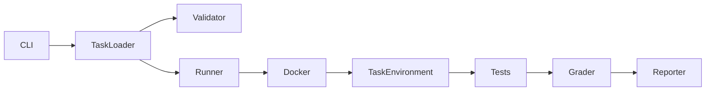

# AgentForge


AgentForge is a Docker-based benchmark and evaluation framework for testing developers and coding agents on reproducible, real-world debugging tasks. It currently provides five benchmarks; it does not publish automated coding-agent evaluation results.

The workflow is deliberately practical: start from a broken environment, investigate it interactively, make a fix, grade the same persistent environment, generate a report, and clean up managed Docker resources.

## Why AgentForge Exists

Modern coding agents are often evaluated on short code-generation tasks that do not reflect the realities of debugging production systems. AgentForge allows teams to measure how well an agent or engineer can:

- reason through a failing environment
- isolate the root cause
- patch a real runtime issue
- validate the fix with automated tests
- document the outcome in a repeatable evaluation report

## Features

- 5 reproducible debugging benchmarks across Docker, Python, AsyncIO, Git, and CI/CD
- Docker-isolated task execution with persistent interactive environments
- a broken → investigate → fix → grade workflow
- automated reference-solution validation of the broken and repaired states
- behavior-based grading and structured JSON and Markdown evaluation reports
- deterministic, label-scoped cleanup of AgentForge-managed Docker resources
- GitHub Actions CI for pytest and validation of all five benchmarks
- benchmark failure analysis documenting root cause, investigation, evaluation criteria, and anticipated failure modes
- local execution without cloud services or external API dependencies

## Architecture



## Quick Start

PowerShell:

```powershell
cd agentforge
python -m venv .venv
.\.venv\Scripts\Activate.ps1
pip install -e .
agentforge --help
agentforge list
```

## CLI Usage

```bash
agentforge list
agentforge inspect <task-id>
agentforge validate <task-id>
agentforge run <task-id>
agentforge grade <task-id>
agentforge solve <task-id>
agentforge report <task-id>
agentforge cleanup
agentforge validate-all
```

## Example

```powershell
agentforge validate docker-network-debug
```

Example output:

```text
AgentForge Task Validator
────────────────────────────────
✓ task directory: Found ...\tasks\docker-network-debug
✓ schema valid: Loaded task 'Docker Network Debugging'
✓ image builds: Built agentforge-docker-network-debug:57d39b80
✓ broken state confirmed: Test failed as expected with exit code 1
✓ reference solution executed: Reference fix applied successfully
✓ post-solution tests passed: Exit code 0
✓ cleanup successful: AgentForge resources removed

Task valid.
```

## Included Benchmarks

| Task | Category | Difficulty | Focus |
| --- | --- | --- | --- |
| docker-network-debug | Docker | Medium | Networking |
| python-dependency-conflict | Python | Medium | Dependencies |
| async-worker-shutdown | Python | Hard | AsyncIO |
| git-history-recovery | Git | Medium | Recovery |
| ci-pipeline-debug | CI/CD | Medium | Pipeline debugging |

## Benchmark Analysis

[Docker Network Debug — Benchmark Analysis](analysis/docker-network-debug.md) documents the root cause, debugging workflow, evaluation criteria, anticipated failure modes, and benchmark quality review.

## Task Format

Each benchmark contains a task directory with these components:

```text
tasks/<task-id>/
├── task.yaml
├── instruction.md
├── environment/
├── solution/
├── tests/
└── ...
```

A task must define:

- metadata in `task.yaml`
- a Dockerfile in `environment/Dockerfile`
- a broken initial environment
- a reference solution in `solution/solve.sh`
- automated tests in `tests/test.sh`

## Evaluation Lifecycle

```text
Broken Environment
        ↓
Agent / Developer Investigation
        ↓
Patch
        ↓
Automated Tests
        ↓
Grader
        ↓
Evaluation Report
```

## Example Evaluation Report

```json
{
  "task_id": "docker-network-debug",
  "success": true,
  "tests_passed": 1,
  "tests_total": 1,
  "duration_seconds": 1.12,
  "exit_code": 0,
  "error_category": "SUCCESS",
  "notes": "Evaluation completed."
}
```

## Design Principles

- deterministic
- realistic
- reproducible
- auditable
- behavior-based testing

## Roadmap

Planned future improvements include:

- coding-agent adapters
- Claude Code integration
- OpenAI Codex integration
- trajectory capture
- difficulty calibration
- parallel evaluation
- benchmark leaderboard

## Motivation

Coding agents are increasingly being used to modify real projects, but many of the benchmark datasets today are too synthetic or too narrow to reflect the actual work of debugging and maintaining software. AgentForge is designed to provide a local, practical evaluation harness for the types of problems engineers encounter every day: bad networking, broken dependency sets, asynchronous shutdown issues, stale Git state, and pipeline failures.

This project is intentionally lightweight and runs locally, so it is suitable for engineering teams, individual practitioners, and portfolio demonstrations that need realistic evidence of debugging capability.
