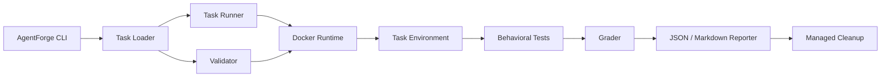

# AgentForge

[](https://github.com/Smruti-Ranjan-009/AgentForge/actions/workflows/ci.yml)

**A Docker-based benchmark and evaluation framework for realistic software-engineering debugging tasks.**

AgentForge gives developers and coding agents a broken, reproducible environment to investigate, repair, grade, report, and clean up. Each benchmark runs in isolated Docker resources, starts from a known failing state, and is validated against behavior-based tests and a reference solution.

> **Current scope:** 5 reproducible debugging benchmarks covering Docker networking, Python dependency conflicts, AsyncIO shutdown behavior, Git recovery, and CI/CD failures.

---

## Why AgentForge

Many coding benchmarks stop at code generation. Real engineering work often starts after the code already exists: a service cannot reach another container, a dependency set is incompatible, an async worker will not shut down cleanly, Git history appears lost, or CI fails even though local development works.

AgentForge is designed around that workflow:

```text
Broken environment
        ↓
Investigate in a real shell
        ↓
Apply a fix
        ↓
Run behavioral tests
        ↓
Grade the same environment
        ↓
Generate a report
        ↓
Clean up managed resources
```

The goal is to make debugging tasks **reproducible, auditable, and easy to evaluate**.

---

## What It Demonstrates

- **Real CLI debugging** inside persistent Linux containers
- **Docker-isolated execution** with label-scoped resource management
- **Behavior-based grading** instead of file-text checks
- **Broken → fixed validation** using reference solutions
- **Persistent run → grade lifecycle** on the same task environment
- **JSON and Markdown evaluation reports**
- **Deterministic cleanup** of AgentForge-managed containers and networks
- **GitHub Actions CI** that runs tests and validates all benchmarks
- **Benchmark analysis** covering root cause, investigation flow, anticipated failure modes, and task quality

No cloud service or external API is required for the current benchmark suite.

---

## Included Benchmarks

| Benchmark | Category | Difficulty | What it evaluates |
| --- | --- | --- | --- |
| `docker-network-debug` | Docker | Medium | Container isolation, Docker DNS, service discovery |
| `python-dependency-conflict` | Python | Medium | Dependency resolution and environment debugging |
| `async-worker-shutdown` | Python / AsyncIO | Hard | Graceful cancellation and async task cleanup |
| `git-history-recovery` | Git | Medium | Reflog/history recovery and repository state |
| `ci-pipeline-debug` | CI/CD | Medium | Pipeline execution, paths, and environment assumptions |

---

## Example: Docker Network Debug

The Docker networking benchmark uses a real two-container environment:

```text
Client / debug container
          |
          | isolated Docker network
          v
     Backend container
```

The task starts with a broken runtime configuration:

```env
BACKEND_URL=http://localhost:8000
```

Inside the client container, `localhost` refers to the client itself—not the backend. The solver must investigate the environment, discover the backend through Docker DNS, and repair the runtime configuration.

```bash
getent hosts backend
curl -v http://localhost:8000
curl -v http://backend:8000
```

The corrected configuration uses the backend service name:

```env
BACKEND_URL=http://backend:8000
```

The grader then verifies the fix with a real HTTP request.

For a detailed task-quality review, see [Docker Network Debug — Benchmark Analysis](analysis/docker-network-debug.md).

---

## Architecture



Core modules:

```text
agentforge/
├── cli.py
├── config.py
├── docker_utils.py
├── grader.py
├── models.py
├── reporter.py
├── runner.py
└── validator.py
```

---

## Requirements

- Python **3.11+**
- Docker Desktop or Docker Engine
- Git
- Windows, macOS, or Linux host

Docker is required for benchmark execution and integration tests.

---

## Quick Start

### 1. Clone

```bash
git clone https://github.com/Smruti-Ranjan-009/AgentForge.git
cd AgentForge
```

### 2. Create an environment

Using `venv`:

```bash
python -m venv .venv
```

Windows CMD:

```cmd
.venv\Scripts\activate
```

macOS / Linux:

```bash
source .venv/bin/activate
```

Or use Conda:

```bash
conda create -n agentforge python=3.11
conda activate agentforge
```

### 3. Install

```bash
python -m pip install --upgrade pip
python -m pip install -r requirements.txt
python -m pip install -e .
```

### 4. Verify

```bash
agentforge --help
agentforge list
```

---

## CLI

```bash
agentforge list
agentforge inspect <task-id>
agentforge validate <task-id>
agentforge validate-all
agentforge run <task-id>
agentforge grade <task-id>
agentforge solve <task-id>
agentforge report <task-id>
agentforge cleanup
```

### Command overview

| Command | Purpose |
| --- | --- |
| `list` | Show available benchmarks |
| `inspect` | Display task metadata and paths |
| `validate` | Verify one benchmark end to end |
| `validate-all` | Validate the complete benchmark suite |
| `run` | Start a persistent interactive task environment |
| `grade` | Grade the active environment |
| `solve` | Execute the reference solution |
| `report` | Generate JSON and Markdown evaluation reports |
| `cleanup` | Remove AgentForge-managed resources |

---

## End-to-End Demo

Start a task:

```bash
agentforge run docker-network-debug
```

AgentForge opens an interactive shell inside the task environment:

```text
Starting task: docker-network-debug

Environment:
Container: agentforge-docker-network-debug

Opening shell...

root@<container>:/workspace#
```

Investigate and fix the task, then exit the shell.

Grade the **same persistent environment**:

```bash
agentforge grade docker-network-debug
```

Example result:

```text
Task Evaluation
────────────────────────────
Task: docker-network-debug
Tests passed:       1 / 1
Task completed:     YES
Exit code:          0
```

Generate reports:

```bash
agentforge report docker-network-debug
```

Clean up:

```bash
agentforge cleanup
```

---

## Benchmark Validation

A benchmark is considered valid only when AgentForge can prove the full lifecycle:

```text
Task files present
        ↓
Schema valid
        ↓
Docker image builds
        ↓
Broken state fails
        ↓
Reference solution executes
        ↓
Post-solution tests pass
        ↓
Cleanup succeeds
```

Example:

```bash
agentforge validate docker-network-debug
```

```text
AgentForge Task Validator
────────────────────────────────
✓ task directory
✓ task.yaml
✓ schema valid
✓ required files
✓ Dockerfile
✓ image builds
✓ backend and isolated network started
✓ broken state confirmed
✓ reference solution executed
✓ post-solution tests passed
✓ cleanup successful

Task valid.
```

---

## Task Format

Each benchmark follows a simple, auditable structure:

```text
tasks/<task-id>/
├── task.yaml
├── instruction.md
├── environment/
│   └── Dockerfile
├── solution/
│   └── solve.sh
└── tests/
    └── test.sh
```

A task defines:

- metadata and timeout configuration
- a reproducible Docker environment
- a deliberately broken initial state
- an instruction that does not reveal the solution
- a reference solution
- behavioral tests that determine success

See [CONTRIBUTING.md](CONTRIBUTING.md) for task-authoring guidance.

---

## Evaluation Reports

`agentforge report <task-id>` writes structured JSON and Markdown reports under `reports/`.

Example JSON shape:

```json
{
  "task_id": "docker-network-debug",
  "success": true,
  "tests_passed": 1,
  "tests_total": 1,
  "duration_seconds": 1.12,
  "exit_code": 0,
  "error_category": "SUCCESS"
}
```

Generated reports are intentionally excluded from version control.

---

## Benchmark Analysis

AgentForge also documents how individual benchmarks should be reasoned about and audited.

Current analysis:

- [Docker Network Debug — Benchmark Analysis](analysis/docker-network-debug.md)

The analysis covers:

- task objective
- environment design
- debugging commands
- root cause
- expected fix
- behavioral verification
- anticipated failure modes
- benchmark quality and limitations

This is intentionally separate from claiming that a specific coding model exhibited those failure modes unless an actual model run has been recorded.

---

## CI

GitHub Actions runs on pushes and pull requests targeting `main`.

The CI workflow:

1. sets up Python 3.11
2. installs project dependencies
3. checks dependency consistency
4. verifies Docker availability
5. runs the pytest suite
6. validates all five benchmarks
7. cleans up AgentForge-managed resources

Workflow: [`.github/workflows/ci.yml`](.github/workflows/ci.yml)

---

## Design Principles

**Deterministic**  
Tasks should begin from a known failure and produce repeatable results.

**Realistic**  
Benchmarks should resemble engineering problems developers encounter in actual repositories and runtime environments.

**Behavior-based**  
Tests should verify the system works, not merely search for expected text in a file.

**Isolated**  
Task resources should not interfere with the host or unrelated Docker resources.

**Auditable**  
Instructions, tests, reference solutions, validation steps, and reports should make success criteria clear.

**Safe cleanup**  
AgentForge removes only resources labeled as AgentForge-managed.

---

## Current Scope and Limitations

AgentForge is intentionally a local, Docker-based evaluation framework.

Current limitations:

- benchmarks are deterministic debugging tasks rather than large open-ended repository changes
- the current suite contains five tasks
- coding-agent adapters are not yet implemented
- command-trajectory capture is not yet part of the core evaluation flow
- there is no hosted leaderboard or multi-user web service

These are deliberate tradeoffs for a small, reproducible benchmark platform.

---

## Roadmap

Potential future work:

- coding-agent adapters
- command-trajectory capture
- repeated model-attempt evaluation
- benchmark difficulty calibration
- parallel benchmark execution
- richer failure categorization
- benchmark result comparison
- optional leaderboard/report aggregation

---

## Contributing

New benchmarks should be:

- reproducible
- behavior-tested
- isolated
- realistic
- deterministic
- solvable by a reference solution
- cleanly removable after execution

See [CONTRIBUTING.md](CONTRIBUTING.md).

---

## License

MIT
